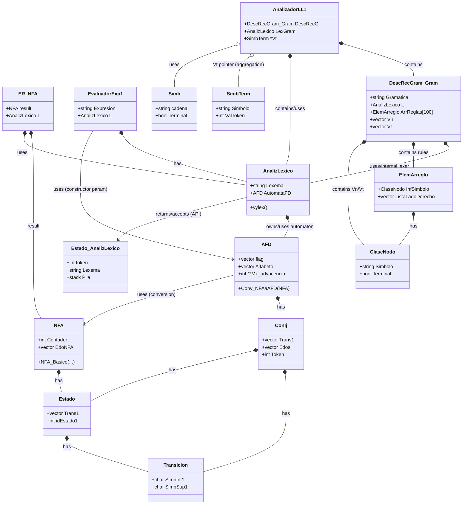

# Project class diagram

This file contains a Mermaid class diagram representing the relationships between the main classes in this repository (inferred from headers under `include/`).

Generated: 2025-11-17

## Mermaid diagram

## Notes and assumptions

- Composition (`*--`) indicates ownership because headers show member variables of the other class (e.g., `AFD` has `std::vector<ConIj>`).
- Association/usage (`-->` or `o--`) indicates looser coupling (method parameters, return types, or pointers).
- No inheritance (`class X : public Y`) was found in the headers scanned, so the diagram shows composition and associations only.
- The diagram was built from the public headers under `include/`. There may be additional private/internal relationships in `src/` implementations; say the word and I will scan `src/` to enrich the diagram.

## How to view

- If your editor supports Mermaid (e.g., VS Code with a Mermaid preview extension), open this file and use the preview.
- Use an online Mermaid live editor or tools like `mmdc` to render to SVG/PNG.
